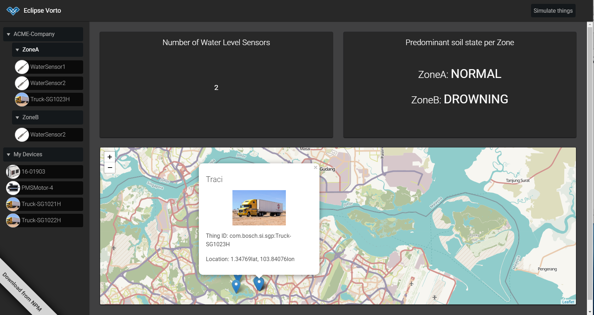

# Vorto Examples

This repository contains example code that have been implemented using the [Eclipse Vorto SDK](https://www.eclipse.org/vorto).

## Vorto Web Dashboard

Node.js/React based web dashboard, that displays device data, which are modelled with Vorto. [Read more](vorto-dashboard/README.md)
 
 
 

## Vorto Generator Plugins

Vorto Generators convert Vorto Models to any platform specific source code. This code can be a simple platform descriptor, device , or backend code. They are stateless in nature and can be easily developed using the [Vorto Plugin SDK](https://github.com/eclipse/vorto/tree/master/plugin-sdk). 

To get started, checkout the [hello world generator](vorto-generators/v2/helloworld-example), that is deployed as a serverless AWS Lambda function.

[Checkout other Example Generators](vorto-generators/Readme.md)

## Vorto Importer Plugins

Vorto Importers convert 3rd party platform descriptions to Vorto models. Just as Generator plugins, they are stateless and can easily be developed using the [Vorto Plugin SDK](https://github.com/eclipse/vorto/tree/master/plugin-sdk). 

To get started, checkout the [LwM2M example](vorto-importers/lwm2m), that converts LwM2M/IPSO XML descriptions to Vorto Function Block - and Mapping models. This example is deployed as a AWS Lambda service.

## Vorto Connector for Bosch Security Cameras

The Vorto Connector integrates Bosch Security Cameras with the Bosch IoT Suite. 
The following [Blog Post](https://blog.bosch-si.com/developer/avoid-tight-coupling-of-devices-in-iot-solutions/) gives a general overview about Vorto and this integration. 

In short, the connector processes Vorto Information Models to retrieve meta-data about the cameras on the one hand, as well as uses the [Vorto Mapping Engine](https://github.com/eclipse/vorto/tree/development/mapping-engine) to convert Camera Binary data to Vorto/Ditto compliant data.

[Read tutorial](vorto-connector/Readme.md) to set it up and run it.

## Using Vorto Models from your custom DSL

If you would like to use and reference Vorto Models from your own custom DSL, the following tutorial shows you how that is done.
 
[Read tutorial](vorto-dsl-integration/Readme.md)
