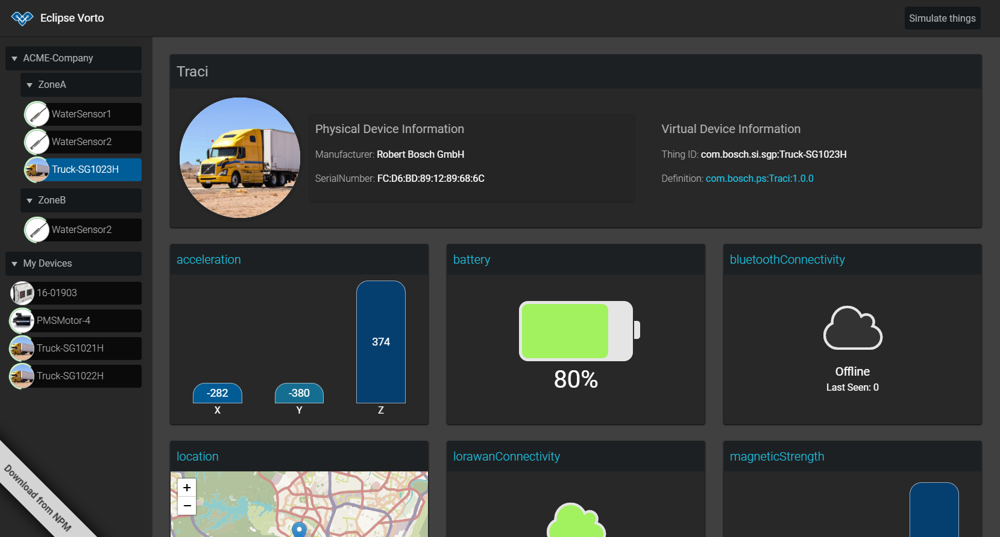

# Vorto Device Dashboard
React and NodeJS based Dashboard that helps quickly prototype IoT Device integrations with the Bosch IoT Suite. 
Integrated IoT devices can be displayed and data visualized.


 

## Installation
```bash
cd vorto_dashboard
yarn install # please use yarn here to avoid any problems

# start the react dashboard
npm start

# start the "backend"
node index.js
```

## Setup Things
1. Create BoschID account
1. Subscribe to Suite for Asset Communication (Beta)
1. Set the namespace in the Asset Communication Dashbard. This is needed to create things.
1. Go to profile -> OAuth2 Clients
1. Create new client (Check the Things checkbox)
1. Copy Client ID, Client secret, scope into the config.json file.
1. Create Things
1. For each device, add an Entry at the policies tab with type "suite-auth" and the clientID from your auth client. Grant thing READ access.

> Once you start the dashboard, all your devices should now be listed and by default, their values will be updated every 5 seconds.


## Extending the Dashboard with custom Cards
If you want to implement custom cards for your own function blocks, [**this short guide**](./extending.md) will serve as a starting point to do so.
