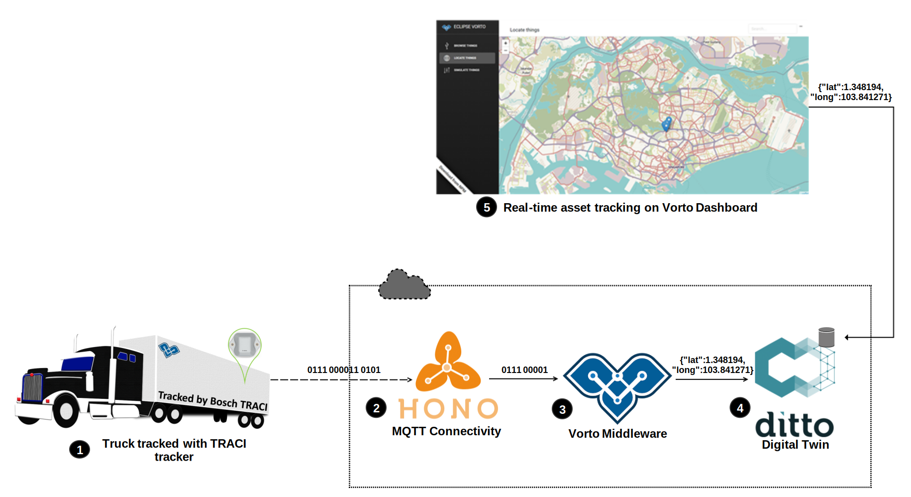

#Vorto Dashboard - Behind the Scenes

## What is Vorto Dashboard?
Vorto Dashboard was developed to help the Vorto community members or interested parties to quickly visualize their IoT devices (real or mocked) and rapidly prototype some use-cases, e.g. asset tracking with dashboard. 

### Asset Tracking
In this use-case we are going to track a truck picking up goods from the city port and delivering them to our warehouse. For this purpose we would be using the Bosch TRACI tag which has the sensors required for the job.

You can try out the solution yourself at [Vorto Dashboard](http://vorto-dashboard.eu-central-1.elasticbeanstalk.com). If you are curious to know how it works, read on to know more. 

## Ok, I am interested, how does it work?
Before we dive-in and uncover the details let's look at the architecture diagram.

### Step 1: 

- The [Bosch TRACI](https://www.bosch-mobility-solutions.com/en/products-and-services/mobility-services/asset-tracing-solution/) tracking device is fixed on the truck. It has sensors for geolocation, temperature, magnetic field and shock monitoring. 

### Step 2:

- The device transmits the sensor values as binary to the [Eclipse Hono](https://www.eclipse.org/hono/) LoRa protocol adapter (Low Power Wide Area Network) and forwards it as is to the Vorto Middleware via AMQP.

### Step 3:

- The Vorto Middleware receives the binary messages and transform them into Vorto compliant human readable JSON format (using the [Vorto Mapping Engine](https://github.com/eclipse/vorto/blob/development/docs/tutorials/create_mapping_pipeline.md) for conversion).
- The Middleware publishes data to an AMQP endpoint.

### Step 4:

- The [Eclipse Ditto](https://www.eclipse.org/ditto/) digital-twin service stores the last state of our TRACI device (geolocation, temperature etc.).

### Step 5:

- Vorto Dashboard periodically polls for registered devices and their last known state from Eclipse Ditto and shows the data in various widgets on the Dashboard.

## What's next?
- [Getting started with Vorto](https://github.com/eclipse/vorto/blob/development/docs/gettingstarted.md)
- Checkout the [Vorto Mapping Pipeline](https://github.com/eclipse/vorto/blob/development/docs/tutorials/create_mapping_pipeline.md)
- [Create a thing in the Bosch IoT Suite using Vorto Information Models](https://github.com/eclipse/vorto/blob/development/docs/tutorials/create_thing.md)

## I would like to know more, how do I get in touch?

Are you looking to build a solution using Vorto Middleware, get in touch with us at [vorto-support@bosch.com](mailto:vorto-support@bosch.com). We help enterprises by hosting production grade infrastructure to transform and normalize your IoT data at scale.

If you would like to host it yourself we provide consulting for your IoT solutions from our team of experienced IoT consultants.

