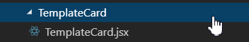
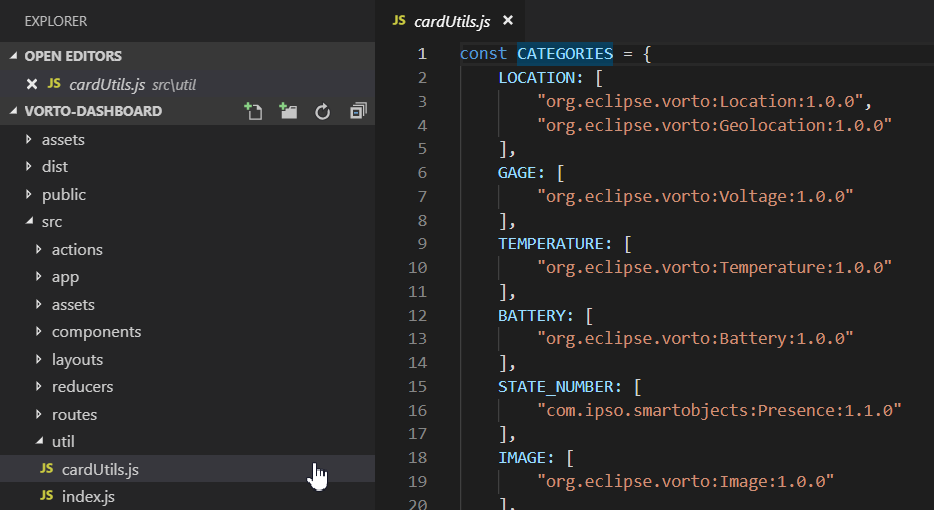
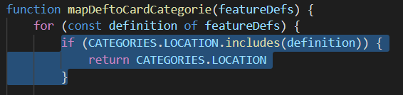
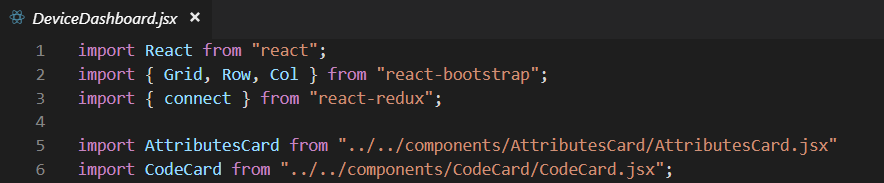
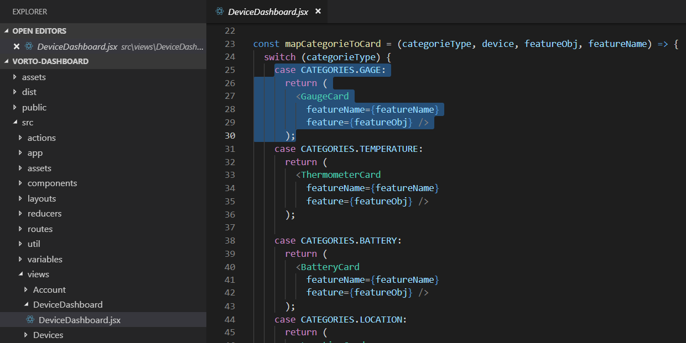
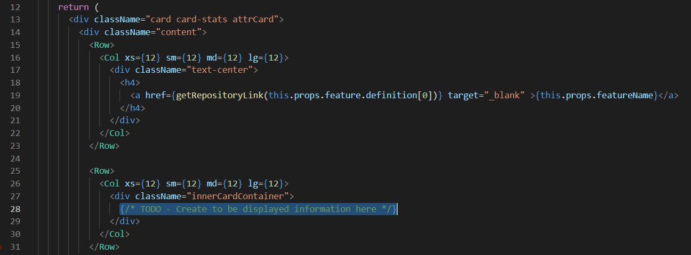

# Extending the Dashboard with custom widgets
By default, the dashboard for now only supports a limited amount of defined vorto compliant function blocks. 
Even though this will be extended in the future, you might want to create UI Cards for custom Function Blocks.

## Step by Step creating a custom Card
**1.** Open the project and duplicate the TemplateCard folder

**2.** Rename the copy to your to be created Card type

**3.** In `utils/cardUtils.js`, add a new category to the `CATEGORIES` variable with the definition of the function block you want to create a Card for

**4.** In the `mapDeftoCardCategories` function, copy and pase one of the if-statements and change the `CATEGORIES.XYZ` to the name of the category you just created.

**5.** In the `views/DeviceDashboard/DeviceDashboard`, add a new case to the switch-statement of the `mapCategorieToCard` function with the categorie and Card you just set up. Don't forget to import your Card at the top of the file.

**6.** The last step is to set up the card itself. Head to the file of your card, get the values that should be displayed and create your the integration in the second `<Row>` element. 

## Already implemented Mappings

### Specific
**Temperature**:
*Requires FB [org.eclipse.vorto:Temperature:1.0.0](https://vorto.eclipse.org/#/details/org.eclipse.vorto:Temperature:1.0.0) **or** integration of [org.eclipse.vorto.types:SensorValue:1.0.0](https://vorto.eclipse.org/#/details/org.eclipse.vorto.types:SensorValue:1.0.0) in status* 

**Battery**:
*Requires FB [org.eclipse.vorto:Battery:1.0.0](https://vorto.eclipse.org/#/details/org.eclipse.vorto:Battery:1.0.0) **or** integration of [org.eclipse.vorto.types:Percentage:1.0.0](https://vorto.eclipse.org/#/details/org.eclipse.vorto.types:Percentage:1.0.0) in status* 

**Location**:
*Requires FB [org.eclipse.vorto:Location:1.0.0](https://vorto.eclipse.org/#/details/org.eclipse.vorto:Location:1.0.0) **or** [org.eclipse.vorto:Geolocation:1.0.0](https://vorto.eclipse.org/#/details/org.eclipse.vorto:Geolocation:1.0.0)* 

### General
**Gauge**:
*Requires Integration of [org.eclipse.vorto.types:SensorValue:1.0.0](https://vorto.eclipse.org/#/details/org.eclipse.vorto.types:SensorValue:1.0.0) in status* 

**Image**:
*Requires Integration of [org.eclipse.vorto:Image:1.0.0](https://vorto.eclipse.org/#/details/org.eclipse.vorto:Image:1.0.0)* 

**State Number**
*Requires Integration of [com.ipso.smartobjects:Presence:1.1.0](https://vorto.eclipse.org/#/details/com.ipso.smartobjects:Presence:1.1.0)* 

**JSON**:
*Doesn't require any additional work, every FB without more specific mapping will be displayed as JSON code*
