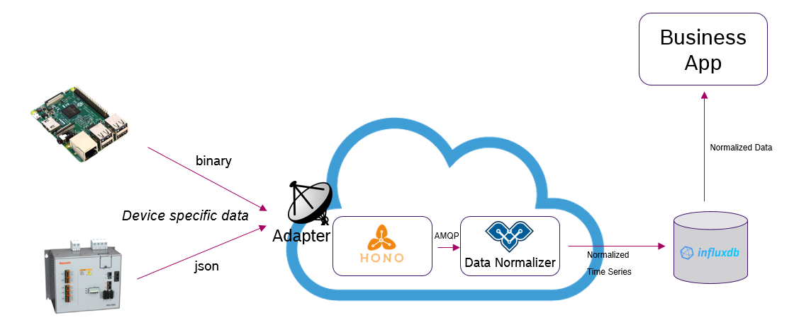

# Getting started with Vorto Normalizer

The Vorto Normalizer is a nice little micro service that receives any device telemetry data from [Eclipse Hono](https://www.eclipse.org/hono) and normalizes it according to [Vorto Information Models](https://github.com/eclipse/vorto/blob/master/docs/vortolang-1.0.md). A payload handler API lets you easily implement custom logic to process the normalized device payload, such as storing it in a Digital Twin service or run analytics. The normalizer provides an out-of-the-box AMQP publish handler that publishes the normalized data to any AMQP message broker, e.g. Amazon MQ. 



## Configuration 

### Environment variables

The following table shows all environment variables that can be configured to run the normalizer:

<table>
	<tr>
		<th>Environment Variable</th>
		<th>Description</th>
	</tr>
	<tr>
		<td>hono.tenantId</td>
		<td>Eclipse Hono tenant ID, in order to receive only tenant-specific telemetry data</td>
	</tr>
	<tr>
		<td>hono.password</td>
		<td>Eclipse Hono AMQP client password</td>
	</tr>
	<tr>
		<td>amqp.url</td>
		<td>AMQP Broker URL, where normalized messages are published to</td>
	</tr>
	<tr>
		<td>amqp.username</td>
		<td>AMQP Broker username</td>
	</tr>
	<tr>
		<td>amqp.password</td>
		<td>AMQP Broker password</td>
	</tr>
	<tr>
		<td>amqp.topic.ditto</td>
		<td>AMQP topic to publish Vorto-Ditto protocol compliant messages. Optional.</td>
	</tr>
	<tr>
		<td>amqp.topic.native</td>
		<td>AMQP topic to publish Vorto native compliant messages. Optional.</td>
	</tr>
</table>

### Vorto Mapping Specification

The Vorto Mapping specifications must be stored under ```src/main/resources/specs```. Take a look at some examples in the folder for naming conventions. 

## Run the service

### Prerequisite

* Maven
* Java 8 or higher

Simple run the following command `mvn clean install springBoot:run`


## Eclipse Hono Device Registry 

When you register a device in Eclipse Hono, you need to provide the following additional default properties 

<table>
	<tr>
		<th>Registry key</th>
		<th>Description</th>
	</tr>
	<tr>
		<td>vorto</td>
		<td>Eclipse Vorto model ID. Example: com.acme.Thermostat:1.0.0</td>
	</tr>
	<tr>
		<td>content-type</td>
		<td>
			Device content-type. The normalizer supports the following content-types:
			<br>
			<ul>
				<li>application/csv</li>
				<li>application/vnd.eclipseditto+json</li>
				<li>application/json</li>
			</ul>
		</td>
	</tr>
	<tr>
		<td>namespace</td>
		<td>Eclipse Ditto namespace. Example <i>com.acme</i>. Only required if messages shall be published to AMQP Ditto-Vorto topic. See chapter configuration.</td>
	</tr>
</table>

Example Device Registry Request Payload:

```js
{
  "enabled": true,
  "device-id": "4711",
  "defaults": {
    "vorto": "devices.aws.button:AWSIoTButton:1.0.0",
    "content-type" : "application/json",
    "namespace" : "com.acme"
  }
}
```

## Developer API


### Provide custom device payload handler

If you want to process the normalized data, e.g. forwarding it to InfluxDB or a Digital Twin Service, you would need to implement the `IPayloadHandler` interface

1. Implement the Handler:

```java
import org.eclipse.vorto.example.mapping.handler.Context;
import org.eclipse.vorto.example.mapping.handler.IPayloadHandler;

public class InfluxDBHandler implements IPayloadHandler {

	private ConnectionProperties connectionProps = null;

	public InfluxDBHandler(ConnectionProperties connectionProps) {
		this.connectionProps = connectionProps;			
	}
	@Override
    public void handlePayload(InfomodelValue normalizedPayload, Context context) {
       // write data to Influx DB
    }
}
```

2. Configure your handler

Add your handler to the `org.eclipse.vorto.example.mapping.config.LocalConfiguration` 
```java
@Bean
public IPayloadHandler influxDBHandler() {
	return new InfluxDBHandler(connectionProperties);
}
```
