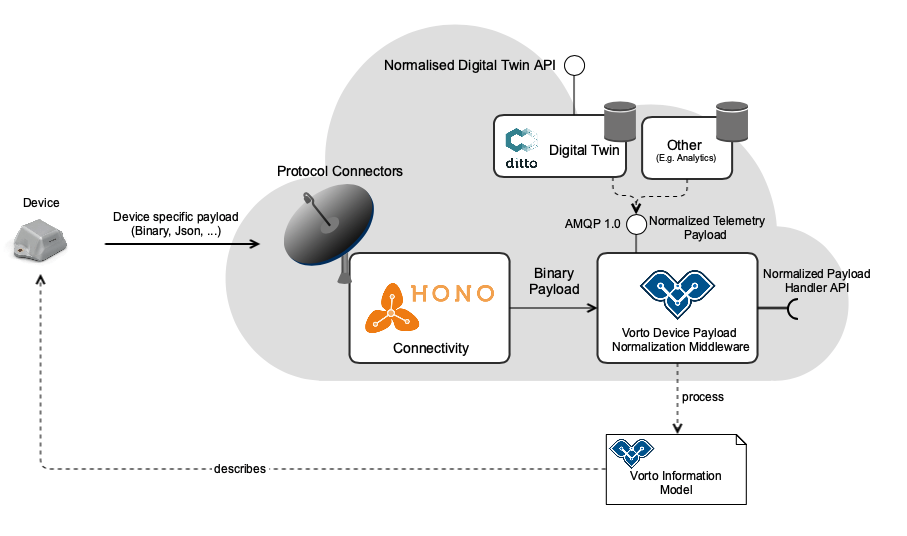
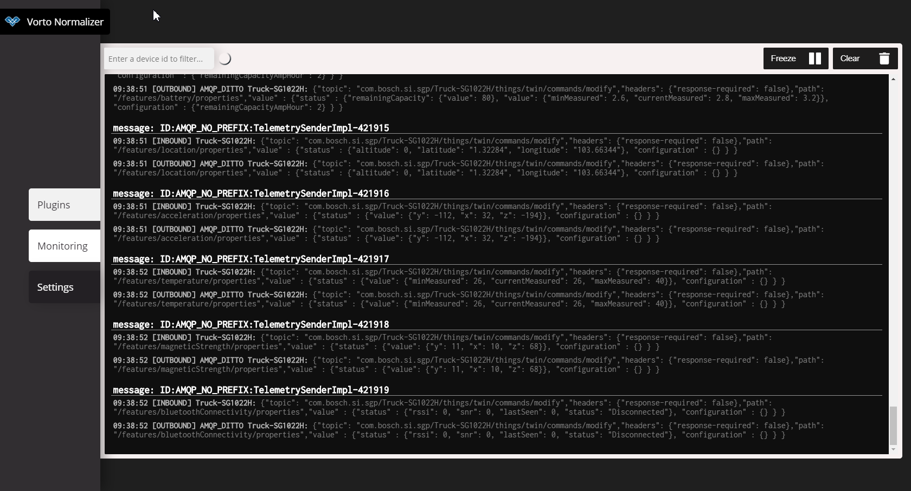

  

# Getting Started with the Eclipse Vorto Semantic Normalizer middleware

  

The Eclipse Vorto Semantic Normalizer middleware is a lightweight, stateless micro service that receives any device telemetry data from [Eclipse Hono](https://www.eclipse.org/hono) and normalizes it according to [Vorto Information Models](https://github.com/eclipse/vorto/blob/master/docs/vortolang-1.0.md). Northbound IoT applications can leverage the semantics of the normalized data, e.g. for data analytics.

  

The service provides an extension point API lets you easily implement custom logic to process the normalized device payload, such as storing it in a Digital Twin service or run analytics on the data.

  

The service supports the publish of normalized data to an AMQP message broker, e.g. Amazon MQ.

  

Please follow [this link](https://github.com/eclipse/vorto/blob/development/docs/tutorials/create_mapping_pipeline.md) to use the Vorto Normalizer middleware for a simple IoT geolocation use case.

  

  

## Vorto Normalizer Frontend

  

The Eclipse Vorto Middleware Frontend is an additional lightweight Angular 8 application, able to visualize the in-and outbounding device payload as well as listing the configured plugins. You can see a running example of what to expect under [this link](http://vorto-middleware.eu-central-1.elasticbeanstalk.com/)

  

  
  
  

# Running the middleware service

You can run the Vorto Normalizer service and frontend out of the box via **Docker**. Thus, getting started is as easy as downloading each of the container from the docker hub and running them as described in the following:

-  **Running the Vorto Normalizer Service:**
	 1. Pull the image from docker hub: 
	 `docker pull vorto/vorto-middleware-service:v1`
	 
	2. Run the image:
	To run the middleware, you need to set the following environment variables:
	`docker run -p 8080:8080 -e hono.tenantId=your_tenantId -e hono.password=your_hono_password 		-e admin.password=password -e amqp.url='amqp_url' -e amqp.username=amqp_username -e amqp.password=amqp_password vorto-middleware-service:v1`

-  **Running the middleware frontend:**
	 1. Pull the image from docker hub: 
	 `docker pull vorto/vorto-middleware-frontend:v1`
	 
	2.  Run the image:
	`docker run -p 4200:4200 vorto-middleware-frontend:v1`

## What's next ?

  

  

*  [Read tutorial](https://github.com/eclipse/vorto/blob/development/docs/tutorials/create_mapping_pipeline.md), that uses the Vorto Semantic Middleware for an IoT Geolocation use case

  

* Read more about the [Vorto Mapping Engine](https://github.com/eclipse/vorto/blob/development/mapping-engine/Readme.md), the core of the Vorto Semantic Middleware