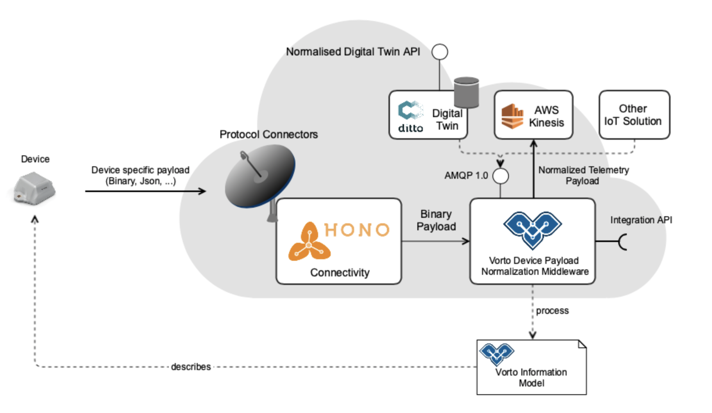

# Vorto Normalizer middleware


# Getting started 

 ## Vorto Normalizer service
The Eclipse Vorto Semantic Normalizer middleware is a lightweight, stateless micro service that receives any device telemetry data from [Eclipse Hono](https://www.eclipse.org/hono) and normalizes it according to [Vorto Information Models](https://github.com/eclipse/vorto/blob/master/docs/vortolang-1.0.md). Northbound IoT applications can leverage the semantics of the normalized data, e.g. for data analytics.

The service provides an extension point API lets you easily implement custom logic to process the normalized device payload, such as storing it in a Digital Twin service or run analytics on the data.

The service supports the publish of normalized data to an AMQP message broker, e.g. Amazon MQ.

Please follow [this link](https://github.com/eclipse/vorto/blob/development/docs/tutorials/create_mapping_pipeline.md) to use the Vorto Normalizer middleware for a simple IoT geolocation use case.



  ## Vorto Normalizer Frontend
The Eclipse Vorto Middleware Frontend is an additional lightweight Angular 8 application, able to visualize the in-and outbounding device payload as well as listing the configured plugins. You can see a running example of what to expect under  [this link](http://vorto-middleware.eu-central-1.elasticbeanstalk.com/)


# Getting started with Docker
You can run the Vorto Normalizer service and frontend out of the box via docker. Thus, getting started is as easy as downloading the container from the docker hub and running it as described in the following: 

 - **Vorto Normalizer Service:**
	To run the middleware, you need to set a few environment variables:
	Start the container via: `docker run -p 8080:8080 -e hono.tenantId=your_tenantId -e 	hono.password=your_hono_password -e admin.password=password -e amqp.url='amqp_url' -e amqp.username=amqp_username -e amqp.password=amqp_password vorto-middleware-service:v1`
 

- **Vorto Normalizer Frontend:**
	Start the container via `docker run -p 4200:4200 vorto-middleware-frontend:v1`


## Configuration

  

### Vorto Mapping Specification

  

Vorto Mapping Specifications contain instructions of how telemetry data is supposed to to be mapped to Vorto properties. It is very easy to create mapping specification using the Vorto Repository Web Editors. Check out the [Mapping Engine Documentation](https://github.com/eclipse/vorto/blob/development/mapping-engine/Readme.md) for details.

  

After you had created the specification, please download it from the Web Editor and store it "as is" under under ```src/main/resources/specs```.

  

## Run the service

  

### Prerequisite

  

* Maven

* Java 8 or higher

  

Simple run the following command `mvn clean install spring-boot:run`

  
  

## Eclipse Hono Device Registry

  

When you register a device in Eclipse Hono, you need to provide the following additional default properties

  

<table>

<tr>

<th>Registry key</th>

<th>Description</th>

</tr>

<tr>

<td>vorto</td>

<td>Eclipse Vorto model ID. Example: com.acme.Thermostat:1.0.0</td>

</tr>

<tr>

<td>content-type</td>

<td>

Device content-type. The normalizer supports the following content-types:

<br>

<ul>

<li>application/csv</li>

<li>application/vnd.eclipseditto+json</li>

<li>application/json</li>

</ul>

</td>

</tr>

<tr>

<td>namespace</td>

<td>Eclipse Ditto namespace. Example <i>com.acme</i>. Only required if messages shall be published to AMQP Ditto-Vorto topic. See chapter configuration.</td>

</tr>

</table>

  

Example Device Registry Request Payload:

  

```js

{

"enabled": true,

"device-id": "4711",

"defaults": {

"vorto":  "org.eclipse.vorto.tutorial:PMSMotor:1.0.0",

"content-type" :  "application/json"

}

}

```

  

## What's next ?

  

*  [Read tutorial](https://github.com/eclipse/vorto/blob/development/docs/tutorials/create_mapping_pipeline.md), that uses the Vorto Semantic Middleware for an IoT Geolocation use case

* Read more about the [Vorto Mapping Engine](https://github.com/eclipse/vorto/blob/development/mapping-engine/Readme.md), the core of the Vorto Semantic Middleware
  
